## Project Overview
Vacation Tracking System (VTS) will provide individual employees with the capability to manage their own vacation time, sick leave, and personal time off

## Introduction

- In modern organizations, employee independence has increased significantly. It is now common for workers to divide their time across multiple projects and report to several managers. As a result, managers have fewer informal interactions with their team members and find it increasingly difficult to monitor and manage vacation schedules effectively.

- This lack of centralized visibility often leads to overlapping absences, manual tracking errors, and administrative delays. The Vacation Tracking System (VTS) is intended to address these challenges by providing a unified digital platform for managing employee leave efficiently and transparently.

## Vision Statement

- The Vacation Tracking System (VTS) will empower employees to manage their own vacation time, sick leave, and personal time off without needing detailed knowledge of company or facility policies. It will streamline HR operations, reduce non-core administrative tasks for managers, and foster a greater sense of autonomy and transparency across the organization.

## Business Goals

- Automate the vacation request process to replace the existing manual approach.
- Accelerate approval workflows to reduce processing time from several days to near real-time.
- Simplify the process for employees to submit vacation requests, including urgent cases.
- Ensure reliability by preventing loss or mismanagement of submitted requests.
- Provide visibility for employees into their time-off history and upcoming leave plans.
- Enable managers to easily view team availability and plan resource allocation.
- Reduce operational costs and increase HR department efficiency through automation and digital record-keeping.

## Scope

- The Vacation Tracking System (VTS) will focus on automating and streamlining the vacation and leave management process within the organization. The system aims to provide web-based access for employees and managers to handle vacation requests, approvals, and tracking efficiently.

### In Scope

- Develop a web-based application accessible through standard browsers.
- Integrate with existing legacy and HR systems to retrieve employee information and update leave balances.
- Provide functionality for employees to request vacation, sick leave, and personal time off.
- Enable managers to review, approve, or reject vacation requests.
- Maintain leave history and provide visibility of team availability.

## Major Features

The Vacation Tracking System (VTS) will include the following key features:

### Rules-Based Validation

- Implements a flexible, rules-driven system to validate and verify employee leave requests according to company policy.

### Manager Approval Workflow

- Supports optional manager approval before finalizing vacation requests, ensuring proper oversight.

### Historical and Future Requests

- Provides access to vacation records from the previous calendar year and allows employees to submit requests up to 18 months in advance.

### Email Notifications

- Sends automated emails to notify managers of pending approvals and employees of status updates.

### Integration with Existing Infrastructure

- Uses the organization’s existing hardware, middleware, and intranet portal for deployment and authentication (via single sign-on).

### Comprehensive Logging

- Maintains detailed activity logs for all transactions and approvals to support auditing and traceability.

### Administrative Overrides

- Allows HR and system administrators to override restrictions when necessary, with all overrides logged.

### Manager-Granted Leave

- Enables managers to directly award personal leave time to employees within predefined system limits.

### Web Service Interface

- Exposes a service endpoint for internal systems to query an employee’s vacation summary programmatically.

### HR System Integration

- Interfaces with legacy HR systems to synchronize employee details, leave balances, and updates in real time.

## Assumption

The following assumptions are considered true for the successful development and deployment of the Vacation Tracking System (VTS):

- All employees and managers have access to the company intranet and valid login credentials.
- An existing HR system and employee database are available for integration.
- Email infrastructure is already configured and supports automated notifications.
- Company leave policies are already defined and can be represented as system rules.
- Each employee has a unique identifier (e.g., Employee ID) in the HR database.
- Users will access the system using modern browsers (Chrome, Edge, Firefox).
- The organization has sufficient server resources to host the web application.

## Constraints

- The following constraints define the limitations and conditions under which the Vacation Tracking System (VTS) will be designed, developed, and deployed:
- The system must be developed using the existing organizational infrastructure and middleware — no new hardware or major software acquisitions are permitted.
- The solution must integrate seamlessly with the existing HR system and other legacy systems already in use.
- The system must send automated email notifications to employees and managers regarding request status changes.
- The initial release will be web-based only; mobile platforms are excluded from the first phase.
- User authentication must utilize the organization’s existing Single Sign-On (SSO) mechanism.
- All data must comply with organizational privacy, security, and data retention policies.
- The project must be delivered within the approved timeline and allocated budget.

# Actors

##	The following are the primary actors that directly interact with the Vacation Tracking System (VTS):

### Employee
 - A regular system user who requests, views, and manages their own vacation, and sick leave.
 - Responsibilities / Interactions:
	- Submit new leave requests.
	- View available leave balances.
	- Track the status of pending and approved requests.
	- Cancel or modify requests before approval.

### Manager
 - A supervisor or team leader responsible for reviewing and approving employee leave requests.
 - Responsibilities / Interactions:
	- Review pending leave requests submitted by employees.
	- Approve, reject, or comment on requests.
	- View team leave schedules and availability.
	- Award additional personal leave days (within system limits).

### HR Clerk (HR Staff)
 - A member of the Human Resources department who ensures compliance with company leave policies and maintains employee leave data.
 - Responsibilities / Interactions:
	- Review and adjust employee leave balances.
	- ensure employees information in all HR systems is up to date and correct
	- Override system restrictions when necessary.
	- Maintain policy configurations within the system.

### System Administrator
 - A technical user responsible for maintaining system configurations.
 - Responsibilities / Interactions:
	- Monitor system performance and logs.
	- Handle system backup and recovery.

## Functional Requirements

### The Vacation Tracking System (VTS) shall provide the following core functionalities:

#### Integration with HR Systems

- The system shall integrate with existing HR and legacy systems to retrieve employee data and update leave balances in real time.

#### Rules-Based Validation

- The system shall implement a configurable rules engine to validate and verify all vacation and leave requests in accordance with company leave policies.

#### Manager Approval Workflow

- The system shall allow managers to review, approve, reject, or comment on leave requests submitted by employees.
- Manager approval shall be optional based on company policy.

#### Historical and Future Requests

- The system shall allow employees to view leave requests from the previous calendar year and submit new requests up to 18 months in advance.

#### Email Notifications

- The system shall automatically send email notifications to:
  - Managers when new leave requests require their approval.
  - Employees when the status of their request changes (approved, rejected, or modified).

#### Administrative Overrides

- The system shall allow authorized HR and administrative personnel to override leave restrictions or system rules.

#### Manager-Granted Leave

- The system shall allow managers to award additional personal leave days to employees within predefined system limits.

#### Leave Summary Interface

- The system shall provide a user interface for employees to view their leave balances, request history, and current request status.

#### Single-sign-on mechanisms

- The system shall be implemented as an extension to the existing company intranet portal and shall utilize the organization’s Single Sign-On (SSO) mechanism for all authentication.

#### Web Service Interface

- The system shall expose a web service API that enables other internal systems to query employee vacation summaries and leave information.

#### Activity Logging

- The system shall record all key transactions, including requests, approvals, rejections, and overrides, in an activity log for traceability and auditing purposes.

## Non-Functional Requirements

### The following requirements describe how the system will perform and interact with other systems.

#### Use of Existing Infrastructure

- The system shall be deployed using the organization’s existing hardware, middleware, and database infrastructure to minimize cost and ensure compatibility.

#### Usability and User Experience

- The system shall provide an intuitive, user-friendly interface that minimizes the learning curve for all user roles.

## ERD Diagram
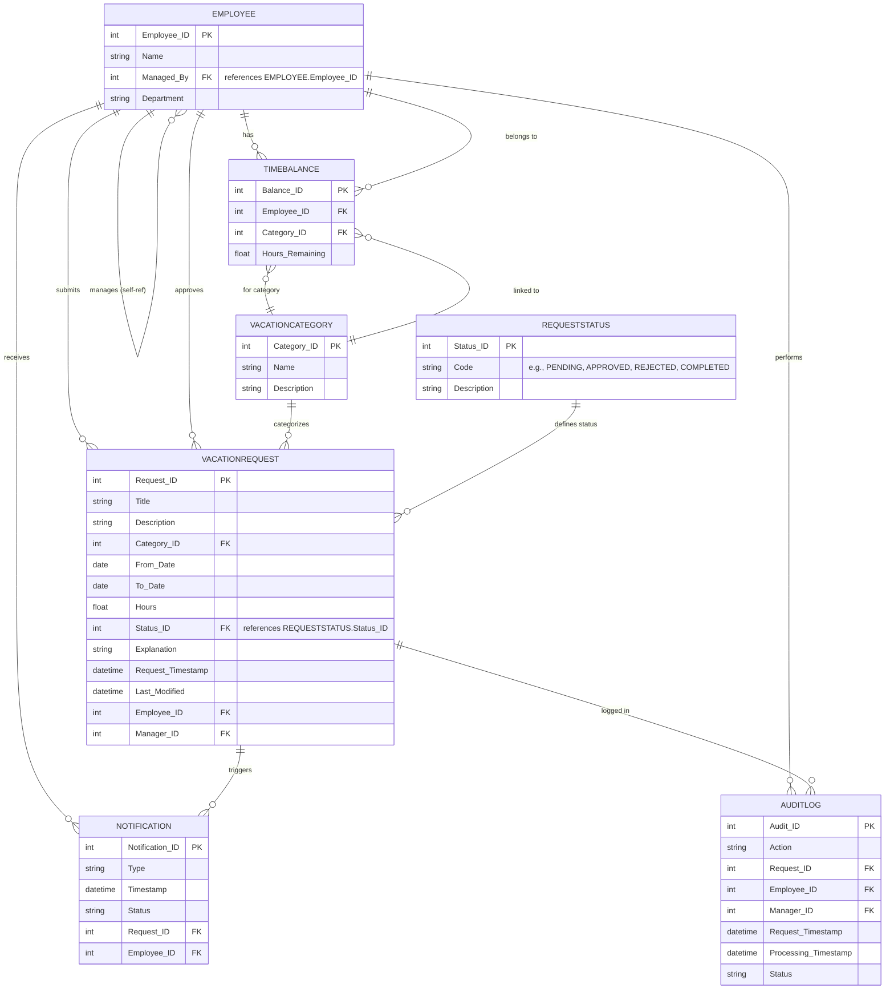
## Use Case

### Create-Request

#### Flowchart
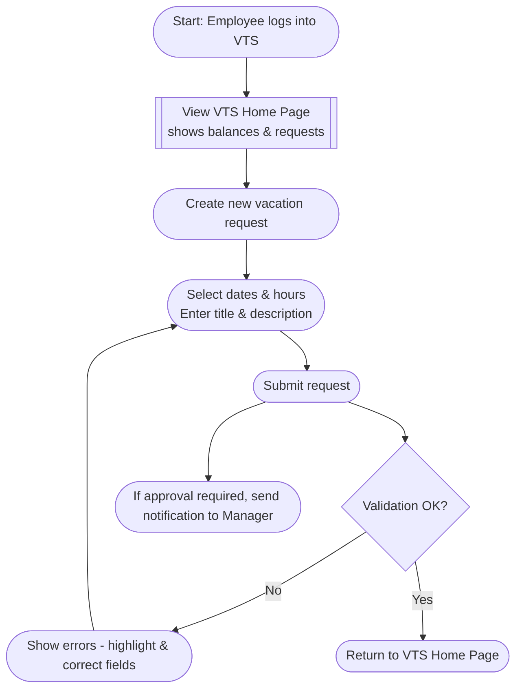
#### Sequence Diagram
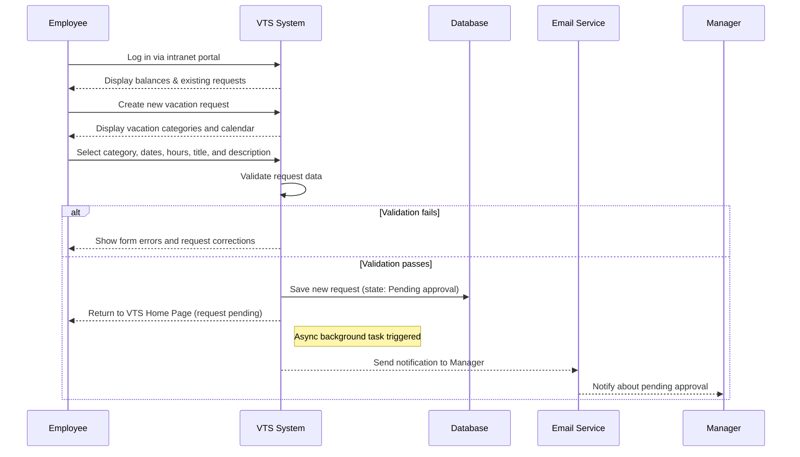

### Edit-Pending-Request

#### Flowchart
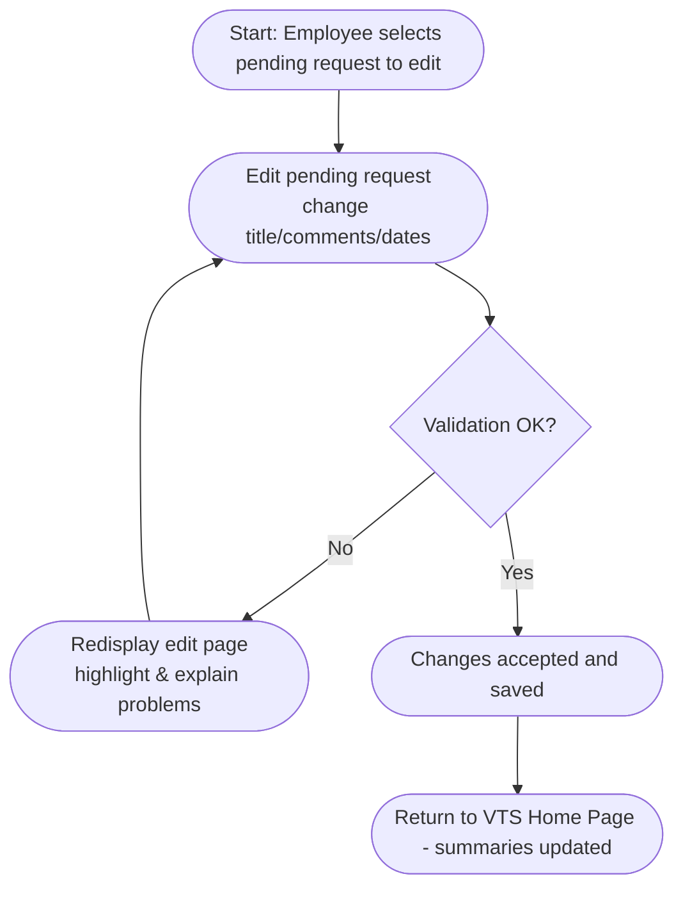
#### Sequence Diagram
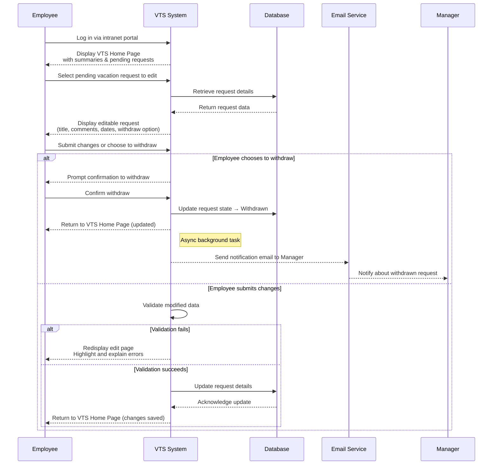

### Cancel-Request

#### Flowchart
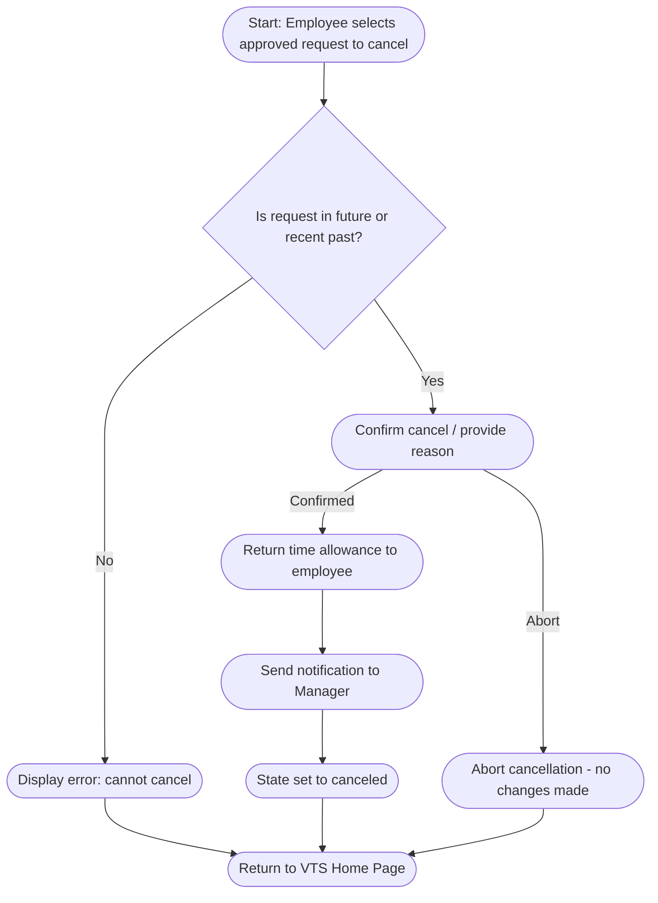
#### Sequence Diagram
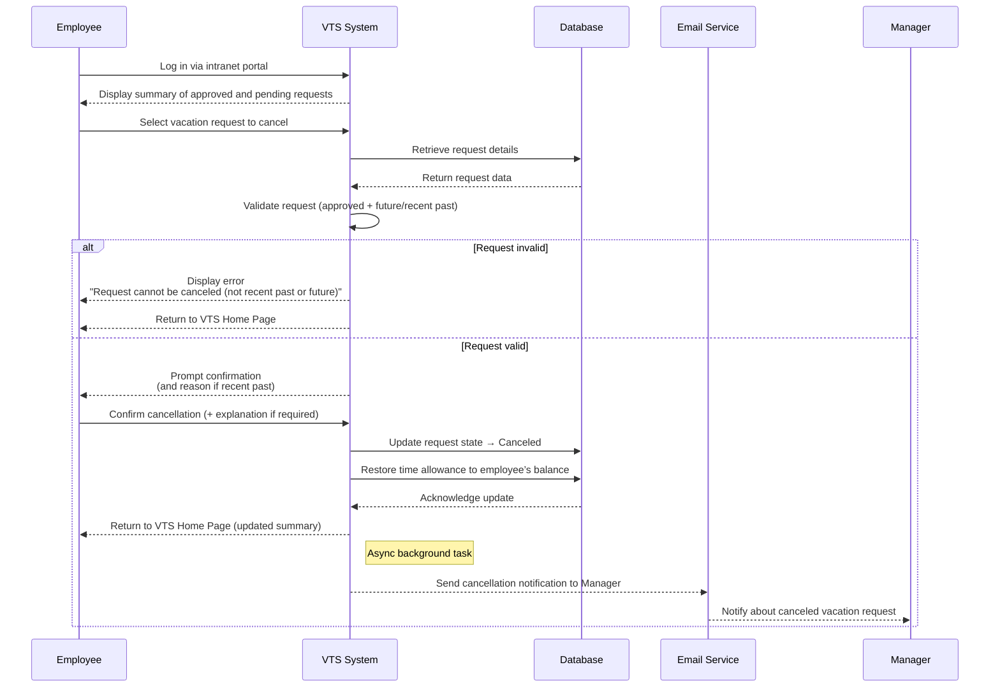

### Withdraw-Pending-Request

#### Flowchart
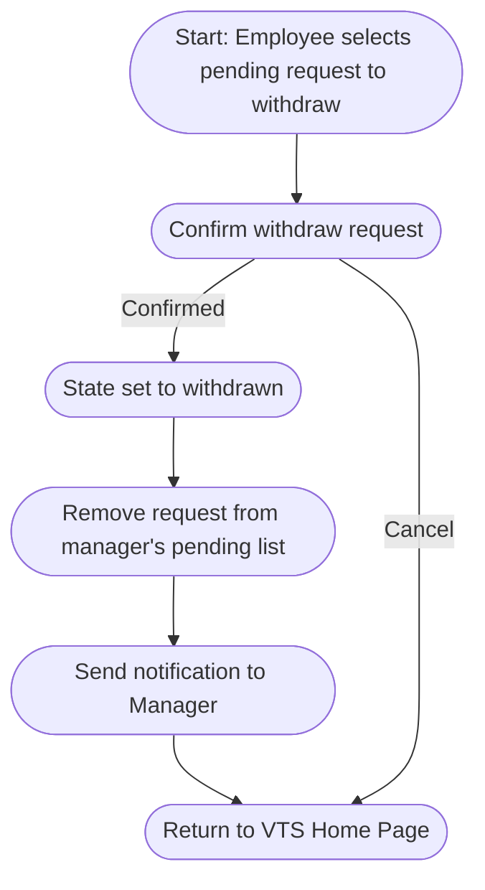
#### Sequence Diagram
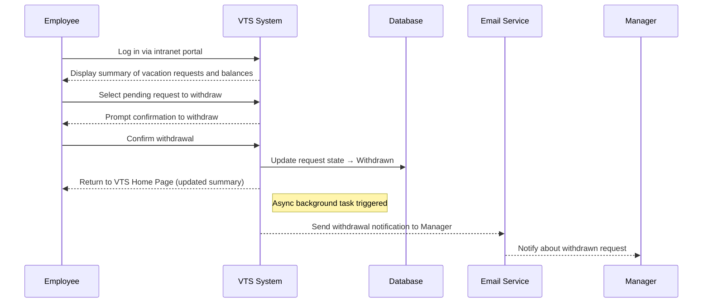

### Manager-Approval

#### Flowchart
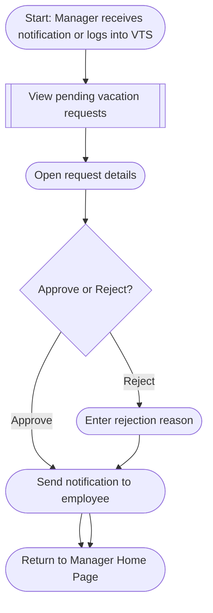
#### Sequence Diagram
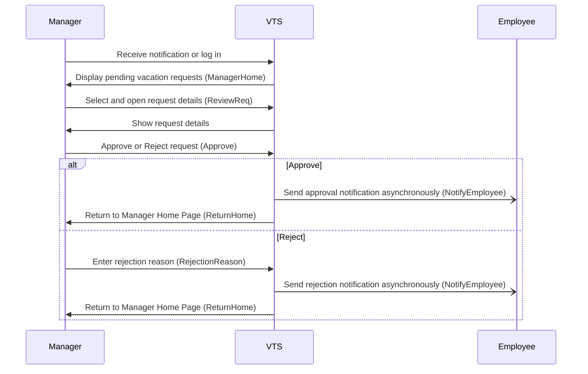

## State Machine Diagram For Request
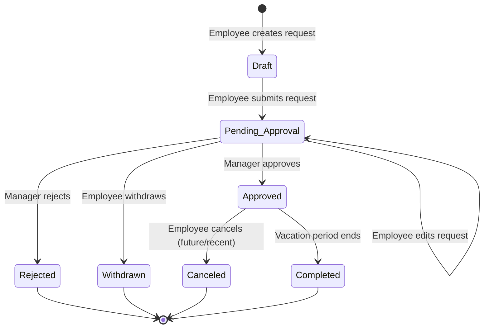

## Initial View for Vacation Requests

### Employee Perspective
- The following interface illustrates how an employee can view their vacation requests within the system.

### Manager Perspective

-This interface shows how a manager can view and manage vacation requests for team members, with the option to act as an employee for his own requests.

